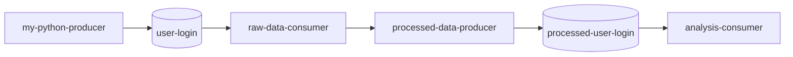
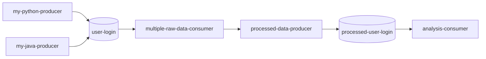

# de-th
Author: Yujie Liao
### Overview:
This project implements a Kafka-based data processing pipeline with the following features:
#### In process.py
Consumer 1: A kafka consumer in process.py reads raw data from the user-login topic, aggregates data in batches of 100 messages, extracting fields like app_version, locale, and device_type.
  Producer: Aggregated data comes from consumer 1. Processed data is published to a new Kafka topic, processed-user-login.
#### In analysis.py
analysis consumer : In analysis.py, a kafka consumer subscribes to processed-user-login topic and consumes data for real-time analysis. It merges incoming aggregated data with historical data in memory for real-time analysis, such as identifying the most popular locale or app version. For further process, the data can saved to SQL database and connect to Tableau for data visualization. 

### How to run this project 
1. `docker-compose up` -- run the docker and you will see the row data on console.
2. `python process.py` -- run the consumer to consumer data from user-login topic.
3. `python analysis.py` -- run the consumer to consumer data from processed-user-login to merge data with historical data for real-time analysis. It analyzes the most polular device type, most popular state, and which state has the most/lease user login. Noted that the device_type is sometimes empty value which might requires to drop when analyze it. 

### Archetecure

### Design Choices
1. Topic
  user-login: Stores raw login events produced by upstream sources.
  processed-user-login: Stores processed login events, such as data enriched with locale-based aggregation or IP validation.
2. Consumer and Producer
The Kafka consumer reads messages from the user-login topic and processes them with Python. The processed messages are published to the processed-user-login topic using a Kafka producer.

### Data Flow:
my-python-producer -> raw-data-consumer processes and aggregates data with 100 messages -> raw-data-consumer produces aggregated data to processed-user-login -> analysis-consumer consumes aggredated data from processed-user-login and performs real-time analysis, such as most popular locale.
1. Efficiency
Batch Processing: The consumer processes messages in batches to reduce overhead and improve throughput to downstream consumers. Instead of producing one message per input, batching (the data in processed-user-login is 100 messaged combined) reduces the number of messages in the processed-user-login topic, improving throughput to processed-user-login by 100 times.

2. Scalability

Producers (my-python-producer and my-java-producer) and consumers (raw-data-consumer, processed-data-producer, analysis-consumer) can scale horizontally. For example, there can be multiple producer (my-python-producer, my-java-producer, etc) that publish data to raw-data-consumer. Similarly, if the volume of processed data grows, more instances of raw-data-consumer can be introduced without affecting the rest of the pipeline.

3. Fault Tolerance

- Topics currently have a replication factor of 1 but it can be increased for production/distribution. 
- Kafka consumers are designed to resume consuming from the last committed offset after being restarted, provided that proper offset management is in place. If a consumer in process.py exits unexpectedly, a new consumer can resume the last committed offset when it restarts. The consumer uses an offset management strategy (auto.offset.reset='earliest') to handle restarts and avoid data loss.

### Additional Questions:
1. How would you deploy this application in production?
While Docker Compose is great for local development and testing, it lacks features for production environments. Kubernetes is better suited for production use cases where high availability, scalability, and fault tolerance are critical. Kubernetes can run and manage Kafka and Zookeeper containers, ensuring they are always available and automatically scaled when needed. 

2. What other components would you want to add to make this production ready?
- To persist data, a SQL/NoSQL database can be connected as a downstream. 
- To visualize data, Tableau dashboard can be connected as a downstream.
- To handle messaged that is failed to be processed, we can use Kafka Dead Letter Queue. The consumer or producer can decide to route the problematic message to a DLQ instead of retrying indefinitely or discarding it.

3. How can this application scale with a growing dataset?
- Add Partitions: Increase the number of partitions for the user-login and processed-user-login topics to distribute the load.
- Horizontal Scaling: Add more consumer instances in the same consumer group to process partitions in parallel.
- Tuning Batch Size: Adjust max.poll.records and fetch.min.bytes for efficient batch processing.
- Scalable Storage: Use cloud object storage such as AWS S3 for archiving older Kafka logs.